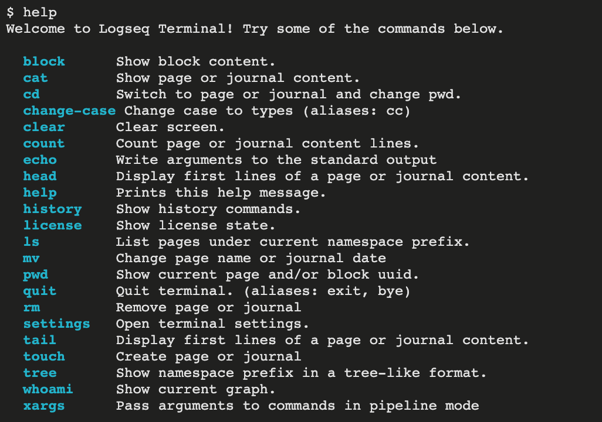

# Logseq Terminal

A terminal simulator for Logseq.

**Note: Terminal is a paid plugin now. I charge a fee for a few of the features in this plugin. Most features are still free to use. Actually, I only charge the use of command history feature, the income will be used to support the development of this plugin.**

## Usage

The default key-binding for the UI is empty. But you can set the key-binding in the Logseq shortcuts settings.

You can learn more from the official [documentation](https://www.vipzhicheng.com/logseq-plugin-terminal/)

## Install

### Manually

1. Git clone this repo
2. Run `npm install`
3. Run `npm run build`
4. In Logseq, click `Plugins` which is in the right top dropdown menu
5. Click the `Load unpacked plugin` button and select the dist directory of this plugin directory
6. If the plugin does not work, you can try to disable and enable the plugin by clicking the switch button on the Plugins page.

### Marketplace

Better choice.
